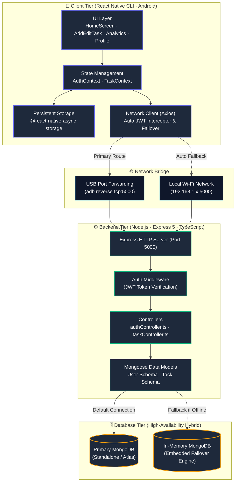
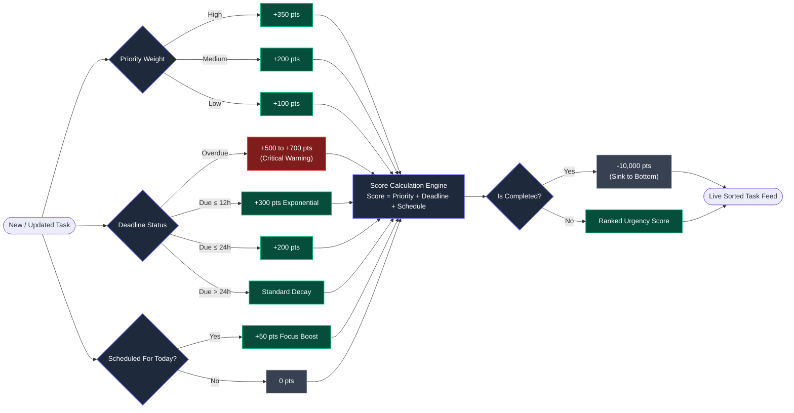

# ⚡ TaskFlow - React Native (TypeScript) & Node.js/MongoDB To-Do App

> **Assignment Submission:** Full-Stack React Native To-Do App with User Authentication for **Modulus Seventeen**  
> **Author:** Ronit Choudhary ([@zeuspavilion](https://github.com/zeuspavilion))  
> **Repository:** [https://github.com/zeuspavilion/TaskFlow](https://github.com/zeuspavilion/TaskFlow)  

---

## 🎯 Assignment Objective & Compliance Matrix

The objective of this project is to build a functional, production-ready Android To-Do mobile application using **React Native CLI (TypeScript)** paired with a **Node.js/Express + MongoDB REST API backend**, featuring secure user authentication, advanced task management, state management, and modern UI/UX design.

### 📋 Requirements & Evaluation Matrix

| Category | Requirement | Implementation in TaskFlow | Status |
| :--- | :--- | :--- | :---: |
| **1. Core Functionality** | User Registration | Validated email & password (6+ chars) registration with bcrypt hashing. | ✅ **Complete** |
| | User Login | Secure JWT authentication with persistent session storage. | ✅ **Complete** |
| | Task Creation | Add tasks with **Title, Description, Date-Time, Deadline, Priority, & Category**. | ✅ **Complete** |
| | Task Completion | 1-tap interactive check toggle with strikethrough animation & completion timestamp. | ✅ **Complete** |
| | Task Deletion | Delete tasks with confirmation dialogs. | ✅ **Complete** |
| | Task Listing | Live feed with status badges, priority ribbons, countdown timers, and pull-to-refresh. | ✅ **Complete** |
| | Backend REST API | Node.js / Express 5 API with MongoDB (Mongoose) + Zero-config in-memory fallback. | ✅ **Complete** |
| **2. Technical Specs** | React Native CLI | Built with React Native CLI `0.76.6` with full TypeScript typing. | ✅ **Complete** |
| | Authentication Flow | JWT Bearer tokens + password hashing + auto auth header injection via Axios. | ✅ **Complete** |
| | State Management | React Context API (`AuthContext` & `TaskContext`) with custom hooks (`useAuth`, `useTasks`). | ✅ **Complete** |
| | Component Architecture | Reusable components (`CustomButton`, `CustomInput`, `TaskCard`, `PriorityBadge`, etc.). | ✅ **Complete** |
| | Clean Structure | Modular layout (`/api`, `/components`, `/context`, `/navigation`, `/screens`, `/theme`, `/utils`). | ✅ **Complete** |
| | Code Comments | Comprehensive inline documentation explaining algorithms, schemas, and components. | ✅ **Complete** |
| **3. Bonus Features 🌟** | Task Due Dates | Full date-time pickers with countdown badges ("Due in 4h", "Overdue by 1d"). | ✅ **Complete** |
| | Smart Mix Sorting Algorithm | Intelligent ranking: $\text{Urgency} = \text{Priority} + \text{Deadline} + \text{Schedule} - \text{Completed}$. | ✅ **Complete** |
| | Categories & Tags | Tagging system (`#Work`, `#Personal`, `#Study`, `#Health`, `#Finance`, `#Urgent`, `#General`). | ✅ **Complete** |
| | Advanced Filtering & Search | Filter by Status (*All/Pending/Completed*), Priority (*High/Med/Low*), Category, and Search. | ✅ **Complete** |
| | Modern UI/UX Design | Obsidian dark mode (`#0B0F19`), neon accent borders, glassmorphism cards, and fluid tabs. | ✅ **Complete** |
| | Analytics & Insights | Productivity dashboard with completion percentage meters and priority breakdown charts. | ✅ **Complete** |

---

## ✨ Features Breakdown

### 🔐 1. Authentication & Security
- **Registration & Login**: Clean input forms with validation and instant error messaging.
- **Password Hashing**: Protected with `bcryptjs` using 10 salt rounds.
- **Stateless JWT Authorization**: Secure session tokens stored locally via `@react-native-async-storage/async-storage`.
- **Demo Quick-Fill**: 1-tap button to load pre-seeded credentials (`demo@taskflow.io` / `password123`).

### 📝 2. Full Task Lifecycle Management (CRUD)
- **Create**: Add tasks with Title, Description, Scheduled Date-Time, Deadline, Priority Level (*Low, Medium, High*), and Category Tag.
- **Read**: Live feed with priority color ribbons, remaining time countdowns, and completion status.
- **Update**: Edit all task attributes or toggle completion status in real-time.
- **Delete**: Remove tasks with safety confirmation alerts.

### 🧠 3. Smart Mix Urgency Algorithm (Bonus)
TaskFlow implements an **Intelligent Urgency Ranking Algorithm** combining multiple priority factors:

$$\text{Urgency Score} = \text{Priority Weight} + \text{Deadline Urgency} + \text{Scheduled Focus} - \text{Completion Penalty}$$

- **Priority Weights**: High (`+350 pts`), Medium (`+200 pts`), Low (`+100 pts`).
- **Deadline Urgency**: Overdue tasks receive a critical alert boost (`+500` to `+700 pts`). Tasks due within 12h–24h scale up exponentially.
- **Scheduled Today**: Tasks scheduled for today gain active focus priority (`+50 pts`).
- **Completed Tasks**: Sunk to the bottom (`-10,000 pts`).

### 🔍 4. Multi-Criteria Filtering & Real-Time Search
- **Instant Search**: Real-time keyword search across task titles and descriptions.
- **Status Filter**: `All`, `Pending`, `Completed`.
- **Priority Filter**: `All`, `High`, `Medium`, `Low`.
- **Category Filter**: Horizontal chip filters for `#Work`, `#Personal`, `#Study`, `#Health`, `#Finance`, `#Urgent`, `#General`.
- **Sorting Selector**: Smart Mix, Nearest Deadline, Priority, Scheduled Time, and Date Created.

### 📊 5. Analytics & Dashboard Insights
- Productivity progress ring with live completion percentage ($0-100\%$).
- Active counters for Pending, Completed, Overdue, and High Priority tasks.
- Visual breakdown of tasks by category and priority level.

### 🛡️ 6. Zero-Downtime Database Architecture
- Connects to standalone MongoDB instances when available.
- **Automatic In-Memory Fallback**: Automatically provisions an embedded MongoDB engine with pre-seeded demo tasks if external MongoDB services are offline.

---

## 🛠️ Technology Stack

| Layer | Technology | Description |
| :--- | :--- | :--- |
| **Mobile App** | React Native CLI (`0.76.6`) | Native Android mobile application |
| **Language** | TypeScript | End-to-end type safety |
| **Navigation** | React Navigation 7 | Native Stack & Bottom Tab navigators |
| **Local Storage** | `@react-native-async-storage` | JWT token and user session persistence |
| **Backend API** | Node.js, Express 5 | RESTful API backend |
| **Database** | MongoDB, Mongoose | Schema validation and document storage |
| **Failover DB** | `mongodb-memory-server` | Zero-configuration database fallback engine |
| **Security** | `jsonwebtoken`, `bcryptjs` | Token generation and secure password hashing |
| **HTTP Client** | Axios | Interceptors for Bearer token & USB/Wi-Fi auto-failover |

---

## 📐 System Architecture & Data Flow

TaskFlow is structured around a decoupled, three-tier full-stack mobile architecture designed for high responsiveness, offline session durability, and zero-downtime database resiliency:



---

### 🧠 Smart Mix Urgency Algorithm Flowchart



---

## 📁 Repository Structure

```
TaskFlow/
├── backend/
│   ├── src/
│   │   ├── controllers/       # authController.ts, taskController.ts
│   │   ├── middleware/        # auth.ts (JWT verification)
│   │   ├── models/            # User.ts, Task.ts (Mongoose schemas)
│   │   ├── routes/            # authRoutes.ts, taskRoutes.ts
│   │   ├── utils/             # sorting.ts (Urgency scoring logic)
│   │   └── server.ts          # Express app entry & database connection
│   ├── .env.example           # Environment template
│   ├── package.json
│   └── tsconfig.json
│
└── mobile/
    ├── src/
    │   ├── api/               # client.ts (Axios + auto JWT interceptor + failover)
    │   ├── components/        # CustomButton, CustomInput, TaskCard, PriorityBadge, etc.
    │   ├── context/           # AuthContext.tsx, TaskContext.tsx
    │   ├── navigation/        # RootNavigator.tsx, AuthNavigator.tsx, TabNavigator.tsx
    │   ├── screens/           # HomeScreen, AddEditTaskScreen, TaskDetailsScreen, ProfileScreen, AnalyticsScreen
    │   ├── theme/             # Modern obsidian dark color palette & styling tokens
    │   ├── types/             # TypeScript data models & navigation types
    │   └── utils/             # dateUtils.ts, sorting.ts
    ├── App.tsx                # App entry with Context Providers
    ├── index.js               # React Native CLI registry
    ├── package.json
    └── tsconfig.json
```

---

## 🚀 Setup & Execution Guide

### 1. Prerequisites
- **Node.js** (v18+)
- **Java JDK** (JDK 17 recommended)
- **Android SDK** (API Level 33+)

---

### 2. Backend Setup

1. Navigate to the backend directory:
   ```bash
   cd backend
   ```
2. Install dependencies:
   ```bash
   npm install
   ```
3. Set up environment variables:
   ```bash
   cp .env.example .env
   ```
4. Build and start the backend:
   ```bash
   npm run build
   npm start
   ```
5. Server will run on `http://0.0.0.0:5000`. Health check endpoint:
   ```
   GET http://localhost:5000/api/health
   ```

---

### 3. Mobile App Setup (Android)

1. Navigate to the mobile directory:
   ```bash
   cd mobile
   ```
2. Install dependencies:
   ```bash
   npm install
   ```
3. Connect your Android device via USB (with USB Debugging enabled) or start an Android Emulator.
4. Set up port forwarding (for physical devices over USB):
   ```bash
   adb reverse tcp:5000 tcp:5000
   adb reverse tcp:8081 tcp:8081
   ```
5. Run the app:
   ```bash
   npm run android
   ```

---

## 📡 API Reference

### 🔐 Authentication (`/api/auth`)
| Method | Endpoint | Description | Auth Required |
| :--- | :--- | :--- | :---: |
| `POST` | `/api/auth/register` | Register a new user account | No |
| `POST` | `/api/auth/login` | Log in and receive JWT token | No |
| `GET` | `/api/auth/me` | Fetch active user profile | **Yes (Bearer Token)** |

### 📋 Tasks (`/api/tasks`)
| Method | Endpoint | Description | Auth Required |
| :--- | :--- | :--- | :---: |
| `GET` | `/api/tasks` | Get filtered & sorted tasks list | **Yes (Bearer Token)** |
| `POST` | `/api/tasks` | Create a new task | **Yes (Bearer Token)** |
| `GET` | `/api/tasks/stats` | Retrieve productivity dashboard statistics | **Yes (Bearer Token)** |
| `GET` | `/api/tasks/:id` | Get details of a single task | **Yes (Bearer Token)** |
| `PUT` | `/api/tasks/:id` | Update task fields or toggle completion | **Yes (Bearer Token)** |
| `DELETE` | `/api/tasks/:id` | Delete a task | **Yes (Bearer Token)** |

---

## 👤 Default Demo Account

For instant evaluation without manual registration:
- **Email:** `demo@taskflow.io`
- **Password:** `password123`

